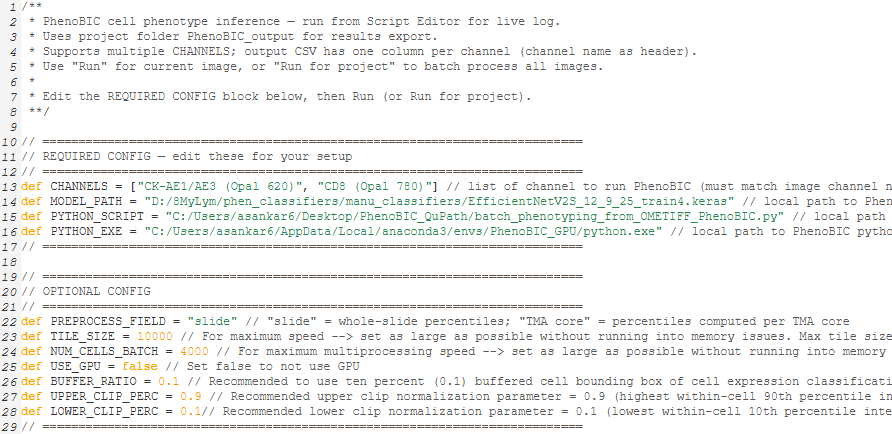

# QuPath PhenoBIC extension

This extension adds support to run **PhenoBIC** (cell phenotype inference) within QuPath. It uses a Python environment to run a tile-based deep learning inference pipeline on multiplex images, while QuPath handles project management, cell segmentation, and measurement export/import.

This extension supports TIFF and TIFF-derived image formats (e.g. OME-TIFF).

---

## Citing

Please cite this extension by linking to this GitHub repository or to the release you used, and consider giving it a star ⭐️

If you use this extension in your work, please also cite the following:

- **QuPath**: Bankhead, P. et al. **QuPath: Open source software for digital pathology image analysis**. *Scientific Reports* (2017). <https://doi.org/10.1038/s41598-017-17204-5>

---

## Installation

### Step 1: Install the PhenoBIC Python environment

You need a Python environment with the PhenoBIC dependencies. You can use conda:

1. Install [Anaconda](https://www.anaconda.com/).

2. Download `environment.yml`

3. In an Anaconda prompt terminal, run this within the directory with the `environment.yml` file to create the PhenoBIC Python environment:

```bash
conda env create -f environment.yml
conda activate PhenoBIC_GPU   
```


**Get the path to the Python executable**

The extension runs the Python script via this executable. Activate your environment and then get the path to the executable:

- (Anaconda Prompt):
  ```text
  conda activate PhenoBIC_GPU
  where python
  ```
  Example output: `C:\Users\...\envs\PhenoBIC_GPU\python.exe`


You will need this path for the script’s **REQUIRED CONFIG** (see below).

### Step 2: Install the QuPath PhenoBIC extension


- Download the latest `qupath-extension-phenobic-*.jar` from [releases](https://github.com/your-org/qupath-extension-phenobic/releases) and either place it in your QuPath extensions directory or drag & drop it onto the QuPath window and choose your user directory when prompted.

Restart QuPath after installing.

---

## Using the PhenoBIC extension

### Running cell phenotyping

1. **Open a project** and an image that has **detections** (i.e. cell segmentations).
2. Go to **Extensions → PhenoBIC → Run PhenoBIC → Cell phenotyping with PhenoBIC**.  
   The main script opens in the script editor.


3. Run the script:

 - **Edit the script config**  

    In the **REQUIRED CONFIG** block at the top, set:
   - `CHANNELS` – list of channel names (must match your image channel names in QuPath). Use **Extensions → PhenoBIC → Run PhenoBIC → Print Channel Names** to print the channel names for the current image.
   - `MODEL_PATH` – full path to your PhenoBIC `.keras` model. Install from [here](https://github.com/your-org/qupath-extension-phenobic/releases)
   - `PYTHON_SCRIPT` – full path to `PhenoBIC_backend.py`. Download the file from this repository onto your machine.
   - `PYTHON_EXE` – path to the Python executable from Step 1.

 - **Optional settings**  
   In the same script you can adjust other parameters to tailer your use of PhenoBIC.
   - `PREPROCESS_FIELD`: Set to `"slide"` or `"TMA core"` depending on whether you would like normalization to be done on a full-image basis or separately for each TMA core (if there are TMA cores). We recommend core-level normalization when working with TMAs.
   - `TILE_SIZE`: Size of tiles used in the back-end. For maximum speed, make this as large as possible without running into memory issues. Will affect speed of the run considerably.
   - `NUM_CELLS_BATCH`: Make this as large as possible without running into memory issues for maximum processing speed. 4,000 by default is fine. Prioritize changing `TILE_size` to improve run speed.
   - `USE_GPU`: Set `true` to use GPU and `false` to not
   - `BUFFER_RATIO`: How much of the mutliplex signal around the cell to feed to the model. Recommended=0.1 → 10% buffering of cell bounding boxes.
   - `UPPER_CLIP_PERC`: Upper clip normalization parameter (recommended=0.9). This is the maximum of the <u>90<sup>th</sup></u> percentile within-cell channel intensity of all cells in the preprocessing field.
   - `LOWER_CLIP_PERC`: Lower clip normalization parameter (recommended=0.1). This is the minimum of the <u>10<sup>th</sup></u> percentile within-cell channel intensity of all cells in the preprocessing field.

 - **Run** – process the current image.

 - **Run for project** – batch process all images in the project.

### PhenoBIC outputs

Outputs are written under the project folder:

- `PhenoBIC_output/measurements/` – TSV files (bounds + normalization parameters). Required for PhenoBIC predictions.
- `PhenoBIC_output/results/` – CSV files with per-channel phenotype classes. This can be used for further downstream single-cell quantitative and spatial analyses.
- QuPath detections are updated with measurements like `{ChannelName}_class` (1.0 = positive, 0.0 = negative). To visualize the cell expression class for any marker channel in the QuPath viewer, go to **Measure → Show measurement maps → {ChannelName}_class**.


---

## Building from source

Build the extension with Gradle:

```bash
gradlew.bat clean build
```

Output JARs are in `build/libs/`.

---

## Notes and troubleshooting

- **No detections**  
  The script requires at least one detection object on the current image. Run cell detection (e.g. StarDist, Cellpose, native QuPath cell detection, etc.) before PhenoBIC.

- **Channel names**  
  `CHANNELS` must match the channel names in QuPath exactly. Use “Print Channel Names” to list them.

- **TMA cores**  
  If using `PREPROCESS_FIELD = "TMA core"`, the image must have a TMA grid and cores; detections are processed per core.

- **Python path**  
  If the subprocess fails, check that `PYTHON_EXE` is correct and that the same environment has the required packages (TensorFlow, tifffile, zarr, etc.). On some systems you may need to set or extend `PATH` so the executable is found.

- **GPU**  
  Set `USE_GPU = true` in the script only if your TensorFlow build and drivers support GPU; otherwise keep it `false` to use CPU.

- **Re-running PhenoBIC on an image**  
  If you need to re-run PhenoBIC, delete or rename the relevant files in `PhenoBIC_output` output directory within the project folder. Also go to **Measure → Show measurement manager** and delete the measurements **Bounds_x**, **Bounds_y**, **Bounds_width**, **Bounds_height**, **{ChannelName}_LowPercentile**, **{ChannelName}_HighPercentile**, and **{ChannelName}_class** so that QuPath knows to re-run PhenoBIC for those channels.

---